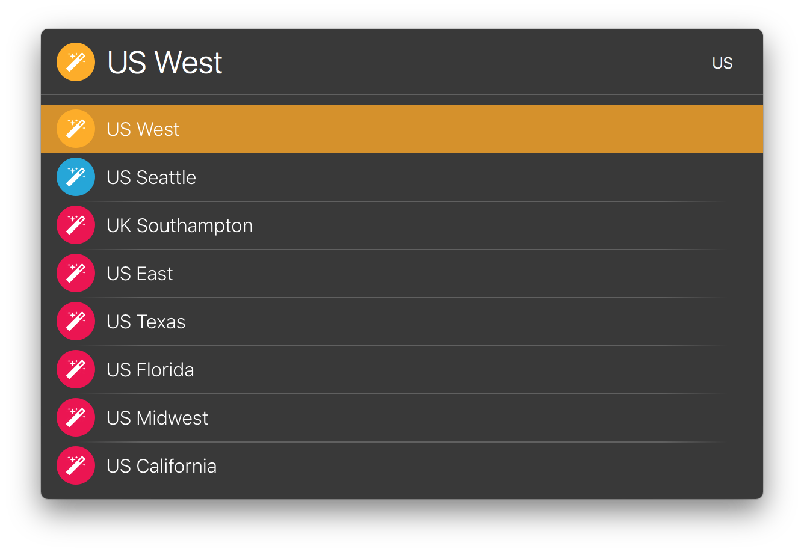

launchbar-viscosity-vpn
=======================

Fork of Johan Abrahamsson's [launchbar-viscosity-vpn](https://github.com/ja-ab/launchbar-viscosity-vpn). Updated to use PDF icons. Changed colors from gray/orange/green to gray/orange/blue. Glyph from [Font Awesome by Dave Gandy](http://fontawesome.io).

Original README
---------------

This action for Launchbar 6 will allow you to connect/disconnect to your VPNs in Viscosity by navigating in to "VPN's" where you will be given a visual indicaiton to the VPN's current status. 

Activating a gray connection will start the VPN while activating a orange/green connection will disconnect it.

Big thank you to [John Purnell](https://github.com/jpcirrus) for adding sorting to the VPN and helping with the code!

Updated Screenshot
------------------

